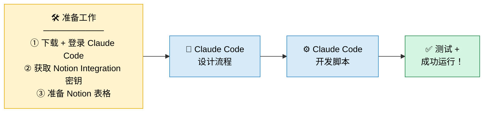

# YouTube Notion Monitor — Claude Code Skill

用 Claude Code 自动监控 YouTube 频道新视频，并同步到 Notion 选题追踪数据库。输入 `/youtube-notion` 一键运行。

---

## 整体流程



---

## 第一步：准备工作

### 1.1 下载并登录 Claude Code

1. 打开终端（Windows 搜索"cmd"或"PowerShell"）
2. 运行以下命令安装 Claude Code：
   ```
   npm install -g @anthropic-ai/claude-code
   ```
3. 运行 `claude` 启动，按提示用浏览器登录你的 Anthropic 账号
4. 登录成功后，终端显示 `>` 提示符，说明已就绪

### 1.2 获取 Notion Integration 密钥

Notion Integration 就像一把"钥匙"，让我们的脚本有权限读写你的 Notion 数据库。

1. 打开 [Notion Integrations 页面](https://www.notion.so/my-integrations)
2. 点击右上角 **+ New integration**
3. 填写名称（如 `YouTube Monitor`），选择你的工作区，点击 **Submit**
4. 创建成功后，页面会跳转，找到 **Internal Integration Token**（以 `ntn_` 开头）
5. 点击 **Show** → **Copy**，保存好这串密钥

> 记得去你的 Notion 数据库页面，点右上角「...」→「连接」，把这个 Integration 连接进去，否则脚本无权访问。

### 1.3 准备 Notion 表格

需要在 Notion 里建好两个数据库：

**表格一：博主 list（记录要监控的频道）**

| 列名 | 类型 | 说明 |
|------|------|------|
| Youtube博主 | 标题 | 频道显示名称，如 `Lenny's Podcast` |
| 主页地址 | URL | 频道主页链接 |
| channelID | 文本 | YouTube 频道 ID（以 `UC` 开头，共 24 位） |

> **怎么找 channelID？** 打开该 YouTube 频道页面，右键点击「显示网页源代码」，按 `Ctrl+F` 搜索 `channelId`，找到类似 `"channelId":"UCxxxxxx"` 的字段，复制引号里的内容。

**表格二：选题列表（自动写入的视频记录）**

| 列名 | 类型 | 说明 |
|------|------|------|
| Title | 标题 | 视频标题 |
| 主页地址 | URL | 视频链接 |
| channelID | 文本 | 来源频道 ID |
| Description | 文本 | 视频描述（已自动清理广告链接） |
| Views | 数字 | 播放量 |
| Likes | 数字 | 点赞数 |
| 发布时间 | 日期 | 视频发布日期 |
| 博主 | 选择 | 博主名称标签（自动按颜色区分不同频道） |

建完表格后，同样需要把 Integration 连接到这个数据库。

---

## 第二步：Claude Code 设计流程

打开 Claude Code，把你的需求用大白话描述给 Claude：

> "我想监控一些 YouTube 频道，每天自动把新视频（标题、链接、播放量、点赞数、描述、发布时间）同步到我的 Notion 数据库。要监控哪些频道也存在 Notion 里，方便随时增减。"

Claude 会根据需求，提出技术方案，并让你选择：
- 用什么语言（Python / JavaScript）
- 存在哪里（Notion / Airtable / 本地文件）
- 怎么触发（手动运行 / 定时自动）

**我们选择的方案：Python 脚本 + YouTube 官方 API + Notion API，手动触发（或 Windows 任务计划定时运行）。**

---

## 第三步：Claude Code 开发脚本

确认方案后，Claude Code 会自动：

1. 创建项目目录和文件结构
2. 编写 `config.py`（配置文件，存放 API 密钥）
3. 编写 `monitor.py`（主程序，实现抓取 + 同步逻辑）
4. 生成 `requirements.txt`（Python 依赖库列表）
5. 生成 `run.bat`（Windows 双击运行的快捷脚本）

你只需要：把 API 密钥填进 `config.py`，运行 `install.bat` 安装依赖，一切就绪。

---

## 第四步：测试 + 成功运行

### 获取 YouTube API 密钥

1. 打开 [Google Cloud Console](https://console.cloud.google.com/)
2. 新建项目（或使用已有项目）
3. 左侧菜单 → **API 和服务** → **库**
4. 搜索 **YouTube Data API v3** → 点击 **启用**
5. 左侧菜单 → **API 和服务** → **凭据**
6. 点击 **创建凭据** → **API 密钥**
7. 复制密钥（以 `AIza` 开头），填入 `config.py` 的 `YOUTUBE_API_KEY`

> **配额说明**：YouTube 每天免费给 10,000 个 API 单位，监控 2 个频道约消耗 400 单位，完全够用，不会产生任何费用。

### 填入配置并运行

打开 `config.py`，填入四个信息：

```python
YOUTUBE_API_KEY            = "你的 YouTube API 密钥"       # AIza 开头
NOTION_API_KEY             = "你的 Notion Integration 密钥" # ntn_ 开头
NOTION_CHANNEL_DATABASE_ID = "博主数据库的 ID"
NOTION_VIDEO_DATABASE_ID   = "选题追踪数据库的 ID"
```

> **数据库 ID 怎么找？** 在 Notion 打开数据库，看浏览器地址栏：`notion.so/你的工作区/这里就是ID?v=...`，复制 `?v=` 前面那段 32 位字符串。

然后在 Claude Code 里输入 `/youtube-notion`，或者直接运行：

```bash
python monitor.py
```

看到类似下面的输出，就说明成功了：

```
🚀 YouTube频道监控脚本启动
📋 共找到 2 个频道

🔍 正在检查频道: Lenny's Podcast
  ✅ 已添加视频: Design has evolved into two paths...
  ✅ 已添加视频: 3 types of designers you need on your team...

✅ 监控完成！本次共添加 7 个新视频
```

打开 Notion，视频已经自动出现在选题追踪表格里了。

---

## 安装依赖

运行一次即可：

```bash
pip install requests
```

---

## 常见问题

**Q：运行后显示"没有发现新视频"，正常吗？**
正常。说明监控的频道最近 7 天没有发新视频，或者已经全部同步过了。

**Q：报错"获取频道列表失败"？**
两个最常见原因：① `config.py` 里的 Notion 密钥填错了；② 忘记把 Integration 连接到 Notion 数据库（在数据库页面右上角「...」→「连接」里操作）。

**Q：报错"获取视频列表失败"？**
检查 YouTube API 密钥是否正确，或者今天配额是否用完（在 Google Cloud Console 里可以查看用量）。

---

## 作者

[@belljia95](https://github.com/belljia95)
